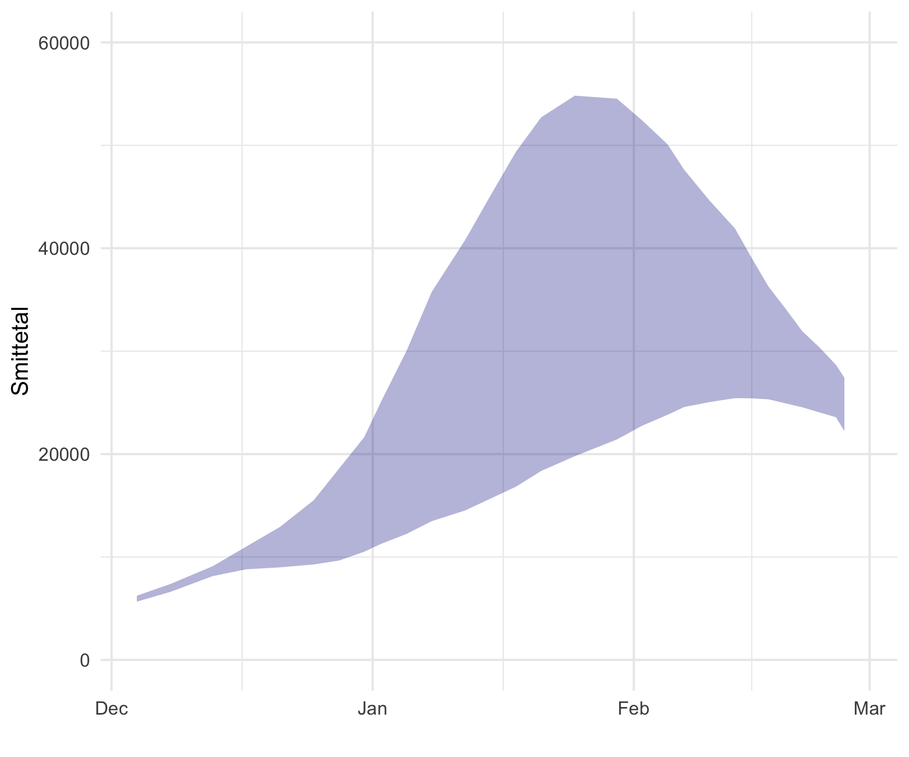

# ssif22forecast

Digitaliseret version af [SSI's fremskrivning](https://www.ssi.dk/-/media/arkiv/subsites/covid19/risikovurderinger/2022/risikovurdering-for-udviklingen-i-epidemien-med-covid19-03012022.pdf?la=da) af smittetal i foråret 2022. Gør det muligt at sammenligne den faktiske udvikling i smittetal med fremskrivningen. Data er aflæst ved hjælp af [WebPlotDigitizer](https://apps.automeris.io/wpd/).

Kode til at genskabe figuren:

```
ssifc <- read_csv("ssifccsv.csv")

ggplot(ssifc,aes(x=date,ymin=ci.lo,ymax=ci.hi)) +
  geom_ribbon(alpha=.3,fill="darkblue") +
  theme_minimal() +
  scale_y_continuous(limits = c(0,60000),breaks=c(0,20000,40000,60000)) +
  labs(x="",y="Smittetal") 
``` 


